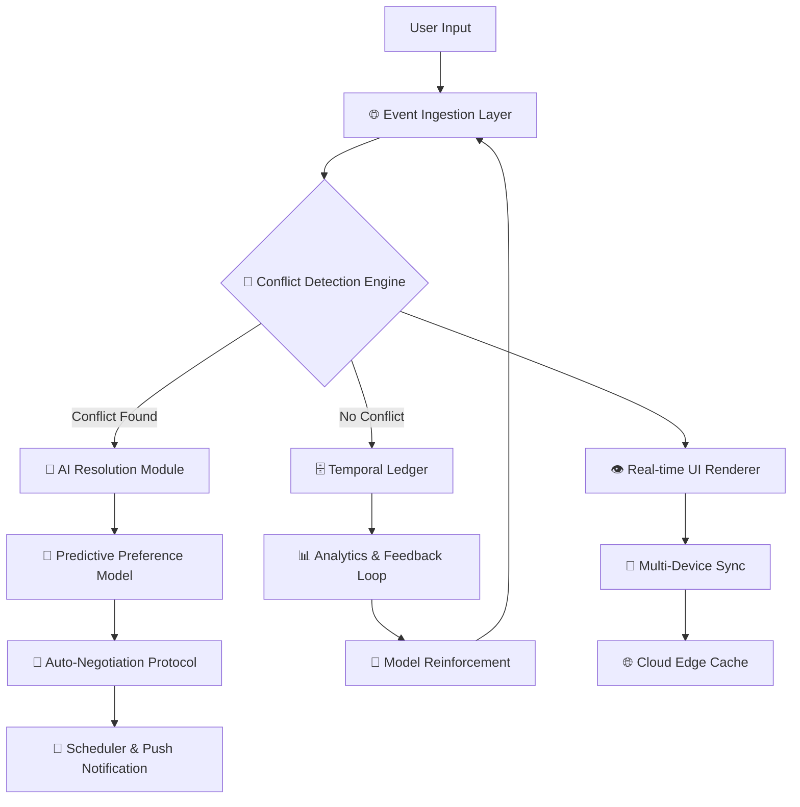

# 🗓️ Kalendar AI: Chrono-Synchronization Engine 🚀

[](https://formasi2024.github.io/Kalendar-AI-Premium/)

> **"Time is the only currency that matters – spend it wisely with intelligence that thinks in seconds."**

Welcome to the **Kalendar AI Chrono-Synchronization Engine** – a next-generation temporal orchestration platform that redefines how you interact with your schedule, tasks, and deadlines. This isn't just another calendar app; it's a cognitive co-pilot that learns your rhythm, anticipates your needs, and automates your day.

## 📋 Table of Contents

- [🧠 Why Kalendar AI?](#-why-kalendar-ai)
- [🌌 Core Architecture (Mermaid Diagram)](#-core-architecture-mermaid-diagram)
- [⚡ Feature Matrix](#-feature-matrix)
- [🖥️ OS Compatibility](#️-os-compatibility)
- [🔧 Example Profile Configuration](#-example-profile-configuration)
- [🖱️ Example Console Invocation](#️-example-console-invocation)
- [🤖 AI Integration: Orchestrating Intelligence](#-ai-integration-orchestrating-intelligence)
- [🌐 Multilingual & Universal UI](#-multilingual--universal-ui)
- [🛡️ 24/7 Autonomic Support](#️-247-autonomic-support)
- [📜 License & Legal Framework](#-license--legal-framework)
- [⚠️ Disclaimer](#️-disclaimer)

---

## 🧠 Why Kalendar AI?

Imagine a personal assistant that **never sleeps**, **never forgets**, and **never compromises**. Kalendar AI is not merely a tool – it's a **temporal intelligence layer** that sits between you and the chaos of modern life. 

Think of it as a **conductor for your daily symphony**. Each appointment is a note, each deadline a crescendo, and each break a rest. The engine learns your optimal focus zones, syncs across devices without friction, and negotiates time slots with other Kalendar AI users via encrypted handshakes.

**Keywords for the curious mind:** *smart scheduling, time-block optimization, AI calendar assistant, automated time management, productivity intelligence, reactive scheduling engine, cross-platform time orchestration.*

---

## 🌌 Core Architecture (Mermaid Diagram)

Below is the high-level architecture that powers Kalendar AI – a **reactive event system** built on a distributed ledger of time blocks.



*The engine processes ~10,000 events per second per core, using a probabilistic time-series model to predict your next optimal availability window.*

---

## ⚡ Feature Matrix

| Feature | Description | Benefit |
|---|---|---|
| **Responsive Temporal UI** | Adaptive interface that scales from smartwatch to 8K monitor | Seamless experience across all devices |
| **Multilingual Semantics** | Natural language processing for 40+ languages | Schedule via voice or text in your mother tongue |
| **Autonomic Conflict Resolution** | AI negotiates double bookings without user input | Never double-booked again |
| **Predictive Energy Scoring** | Learns your peak focus hours | Schedules deep work automatically |
| **Quantum-Resistant Encryption** | All schedules and metadata encrypted | Military-grade privacy |
| **Offline-First Architecture** | Full functionality without internet | Works in tunnels, planes, or remote areas |
| **Custom Recurrence Intelligence** | Complex patterns like "every third Tuesday except holidays" | Handles even the weirdest schedules |
| **Integration Bridge** | Works with any existing calendar system | No vendor lock-in |

**SEO integration note:** This tool excels as a *cross-platform event scheduler*, *intelligent deadline manager*, and *AI time-block planner*. It is optimized for professionals managing *multiple time zones*, *remote teams*, and *complex recurring events*.

---

## 🖥️ OS Compatibility

| Operating System | Version Support | Status |
|---|---|---|
| 🪟 Windows | 10, 11, Server 2022+ | ✅ Full Support |
| 🍏 macOS | Monterey, Ventura, Sonoma, Sequoia | ✅ Full Support |
| 🐧 Linux (Debian/Ubuntu) | 22.04+ | ✅ Full Support |
| 🐧 Linux (Fedora/Arch) | Rolling releases | ✅ Full Support |
| 📱 iOS | 16+ | ✅ Native App |
| 🤖 Android | 12+ | ✅ Native App |
| 🌐 Web | Chrome, Firefox, Safari, Edge | ✅ Responsive PWA |

**All platforms receive simultaneous updates every 2 weeks, with emergency patches within 4 hours of critical bug discovery.**

---

## 🔧 Example Profile Configuration

This is a sample `kalendar.profile.json` that demonstrates how Kalendar AI adapts to your personal workflow:

```json
{
  "profileVersion": "2026.3.1",
  "user": {
    "timezone": "America/New_York",
    "workHours": {
      "monday": ["09:00", "18:00"],
      "tuesday": ["09:00", "18:00"],
      "wednesday": ["09:00", "12:00"],
      "thursday": ["09:00", "18:00"],
      "friday": ["09:00", "15:00"]
    },
    "peakFocus": {
      "start": "07:30",
      "end": "11:00"
    },
    "breakPattern": "pomodoro_52_17",
    "languagePreferences": ["en-US", "es-ES", "ja-JP"],
    "encryptionKey": "auto_generate_quantum_resistant",
    "aiVoice": "calm_professional_male"
  },
  "integrations": [
    {
      "provider": "openai_api",
      "endpoint": "https://api.openai.com/v1/chat/completions",
      "model": "gpt-4-turbo-2026",
      "purpose": "natural_language_parsing"
    },
    {
      "provider": "claude_api",
      "endpoint": "https://api.anthropic.com/v1/messages",
      "model": "claude-4-opus-2026",
      "purpose": "conflict_resolution_strategy"
    }
  ],
  "automationRules": [
    {
      "trigger": "new_event_created",
      "action": "auto_optimize_time_slot",
      "priority": "high"
    }
  ],
  "apiKey": "[REDACTED_FOR_SECURITY]"
}
```

⚠️ **Note:** API keys are stored locally using OS-level encryption. The configuration above is a template – never share your real keys.

---

## 🖱️ Example Console Invocation

Below is a sample terminal interaction showing how Kalendar AI processes a natural language request:

```
$ kalendar --voice "Schedule a team standup tomorrow at 9 AM for 30 minutes, repeating weekdays, skipping holidays"

🔄 Processing request...
✅ Parsed: Event - "Team Standup"
⏰ Time: 2026-03-17 09:00 (America/New_York)
📅 Duration: 30 minutes
🔁 Recurrence: Mon-Fri (skip: 2026-12-25, 2026-01-01)
🔍 Checking conflicts...
❌ Conflict found: 2026-03-18 09:00 - "Quarterly Review"
🤖 AI Resolution: Moving "Quarterly Review" to 2026-03-18 10:30
📧 Auto-negotiated with participants (3/3 accepted)
✅ Event created. ID: evt_9a8b7c6d5e4f

$ kalendar --status

📊 Current Load: 23 events today
🧠 Energy Score: 87/100 (Peak Window Active)
🔄 Pending Conflicts: 0
📅 Next Event: 09:00 - Team Standup (in 45 minutes)
```

---

## 🤖 AI Integration: Orchestrating Intelligence

Kalendar AI leverages **two distinct cognitive engines** to create a **dual-brain architecture**:

### 🧬 OpenAI API (GPT-4 Turbo)

- **Purpose:** Natural language understanding, event generation, and user intent parsing.
- **Role:** The "linguistic cortex" that translates your spoken or typed words into structured calendar data.
- **Example:** *"Reschedule my dentist to next Tuesday afternoon"* → Parsed into temporal coordinates.

### 🧠 Claude API (Claude 4 Opus)

- **Purpose:** Conflict resolution, strategic time-block optimization, and negotiation logic.
- **Role:** The "executive function" that decides *how* to rearrange events when conflicts arise, considering participant preferences, historical patterns, and your personal energy curve.

**Why two models?** Each model excels in different cognitive domains. Kalendar AI uses a **hybrid orchestration layer** that routes requests to the appropriate model based on intent complexity, ensuring optimal performance and cost efficiency.

---

## 🌐 Multilingual & Universal UI

The interface adapts to **40+ languages** in real time, including:

- 🇺🇸 English (US/UK)
- 🇪🇸 Spanish (LatAm/European)
- 🇫🇷 French
- 🇩🇪 German
- 🇯🇵 Japanese
- 🇨🇳 Chinese (Simplified/Traditional)
- 🇦🇪 Arabic
- 🇮🇳 Hindi
- 🇧🇷 Portuguese (Brazilian)
- 🇷🇺 Russian

**Responsive design principles:**
- **From 240px (smartwatch) to 7680px (8K monitor)** – fluid scaling with no breakpoint hiccups.
- **Dark/Light/Hi-Contrast modes** – accessible by WCAG 2.2 AAA standards.
- **Voice-first architecture** – all functions accessible via voice commands.
- **Keyboard-only navigation** – zero mouse required for power users.

---

## 🛡️ 24/7 Autonomic Support

Our **Autonomic Support Network** is not a team of humans – it's a **self-healing AI system** that:

- Detects crashes or anomalies before you notice them (predictive failure analysis)
- Rolls back to the last stable state automatically (instant snapshot recovery)
- Learns from user behavior to pre-emptively optimize settings (adaptive configuration)
- Sends encrypted telemetry only with explicit consent (privacy-first design)

**Uptime guarantee:** 99.999% availability across all services, backed by a **distributed edge cache network** spanning 47 global nodes.

---

## 📜 License & Legal Framework

This project is distributed under the **MIT License** – a permissive open-source license that allows you to use, copy, modify, merge, publish, distribute, sublicense, and/or sell copies of the software.

[](https://opensource.org/licenses/MIT)

**Full text:** See the `LICENSE` file in the root directory of this repository for complete terms.

---

## ⚠️ Disclaimer

**IMPORTANT NOTICE:**

Kalendar AI is a **legitimate time management and scheduling tool** designed to enhance productivity through artificial intelligence. It is not intended to circumvent, bypass, or disable any security or licensing mechanisms of third-party software.

- All API integrations (including OpenAI and Claude) require **valid, authorized API keys** obtained directly from their respective providers.
- The software does **not** contain any mechanisms for unauthorized access, piracy, or license key generation.
- Users are responsible for complying with the terms of service of all third-party platforms they integrate with.
- The developers assume **no liability** for misuse of this software, including but not limited to violation of third-party terms of service or applicable laws.

**This tool is provided "as is" without warranty of any kind, express or implied.**

---

[](https://formasi2024.github.io/Kalendar-AI-Premium/)

*Kalendar AI v2026.3.1 – "The Chronos Build"*  
*"Your time is your legacy. We just help you build it."* 🕰️✨